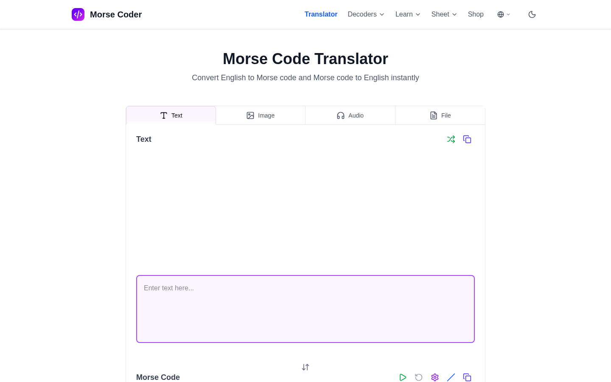
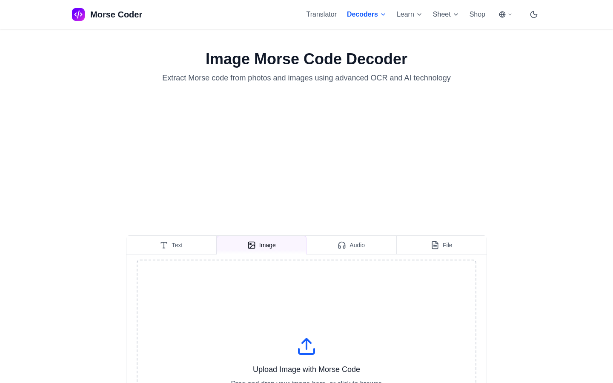
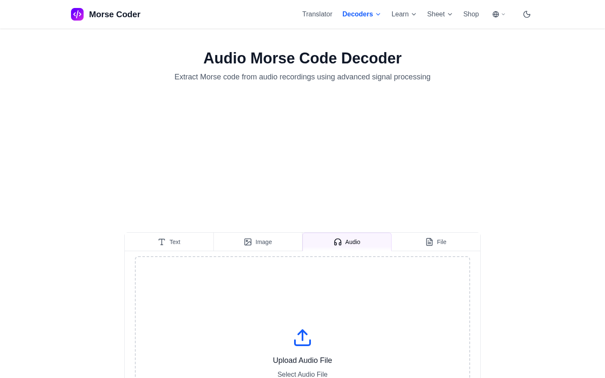

  

# Morse Coder

Official public repository for [morse-coder.com](https://morse-coder.com). Morse Coder is a browser-based Morse workspace for translating, playing, decoding, and learning Morse code from text, files, images, and audio.

This repository is the public home for product feedback, issue reports, roadmap notes, support guidance, and community discussion. It does not contain the private production source code for the live website.

## Product Preview

| Image decoder | Audio decoder |
| --- | --- |
|  |  |

## Product Focus

- Learners practicing Morse alphabet, timing, abbreviations, and phrases
- Amateur radio and emergency-communication users checking references
- Users decoding pasted Morse, uploaded text files, screenshots, or recordings
- Teachers and writers who need printable Morse reference material

## Main Workflows

- Translate text to Morse and Morse to text in real time.
- Play Morse audio, adjust settings, and use visual light output for practice.
- Use AI-assisted image decoding with OCR, manual correction, and analysis for uploaded photos or screenshots.
- Decode MP3, WAV, M4A, AAC, and OGG Morse recordings.
- Use printable reference sheets for alphabet, numbers, abbreviations, common words, and phrases.

## What To Open Here

- Translation, spacing, punctuation, timing, or playback issues
- Image Morse decoding problems where OCR or manual correction needs better handling
- Audio decoder files that fail or produce confusing output
- Reference-sheet clarity for beginner, radio, or emergency practice

## Repository Boundary

- Public issues and discussions are welcome when they improve the live product experience.
- Do not post private account data, secrets, payment details, uploaded personal media, or sensitive logs.
- Production application code, provider credentials, billing configuration, and deployment secrets are not published here.
- Security reports should follow [SECURITY.md](SECURITY.md) instead of public issues.

## Official Links

- Website: [morse-coder.com](https://morse-coder.com)
- Roadmap: [ROADMAP.md](ROADMAP.md)
- Support: [SUPPORT.md](SUPPORT.md)
- Security: [SECURITY.md](SECURITY.md)

## Support

For product questions, use GitHub issues when the topic can be public. For account, billing, abuse, privacy, or security-sensitive questions, email contact@gencoloring.ai.
